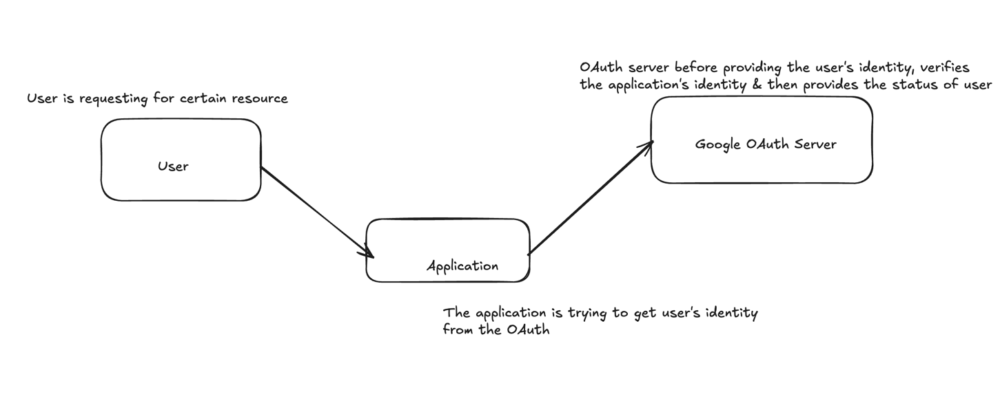

## User Microservice 

### consists of 3 main models 
- BaseModel : id, isDeleted
- User : name, email, password
- Token : value/token, expiryAt
- Role : value

------------

#### In order to control the request & response of invoke requests, dto's, is being created
- signUpRequestDto & UserResponseDto
- LoginRequestDto
-----------

#### service
- currently, since this microservice consists of only userService, therefore, ``UserService`` is been added as ``class`` instead of `interface`
- Service consists of `/login`, `/signup` & `/validate{token}` functions

---------

#### More control over data between different services 
- As per standards, we shouldn't share all the details of one service to other, ( Eager loading )
- Sharing only the essential details when calling a service. 
```java
@PostMapping("/signup")
public UserResponseDto signUp(@RequestBody SignUpRequestDto signUpRequestDto){

        User user = userService.signUp(
                    signUpRequestDto.getName(),
                    signUpRequestDto.getEmail(),
                    signUpRequestDto.getPassword()
        );

        return UserResponseDto.from(user);
    }
```
- Here, from the requestDto, we have the control, to share which info to service. 
- Similarly, we can control what response data to be returned using ``UserResponseDto.from(user);``, converts user object to userDto

#### Authentication via Bcrypt encoder

> Note : if we want to add autowire/inject the dependency into our service, we should create a `Bean` as a `configuration`
```java
@Configuration
public class EncoderConfig {

    @Bean
    public BCryptPasswordEncoder getBCryptPasswordEncoder() {
        return new BCryptPasswordEncoder();
    }
}
```
- This has been used as dependency in ``UserService constrcutor`` 
- By default, `Spring-security` as dependency blocks every endpoint, and gives `401 Unauthorized` 
- For that we need to provide, another config, ``SecurityConfig``, permitting(` .anyRequest().permitAll()`) every requests by default
- [Spring Security](https://www.baeldung.com/spring-security-with-maven)
```java
@Configuration
public class SecurityConfig {

    @Bean
    public SecurityFilterChain securityFilterChain(HttpSecurity http) throws Exception {
        http
                .authorizeHttpRequests((requests) -> {
                            try {
                                requests
                                        .anyRequest().permitAll()
                                        .and().cors().disable()
                                        .csrf().disable();
                            } catch (Exception e) {
                                throw new RuntimeException(e);
                            }
                        }
                );
        return http.build();
    }
}
```


### Integrating UserService <-> ProductService

> Problem Statement : 
trigger the userService for generating token, use this token in productService header & trigger the userService to validate this token for getting product details

- As per the PS, in the logic to `/validate` is in userService(AuthServer), the changes in `productService`, 
 ```java
@GetMapping("/validate/{id}")
public Product validateTokenAndGetProduct( @RequestHeader("Token") String token,
    @PathVariable("id") Long id) throws ProductNotFoundException {
    if(!tokenService.validateToken(token)){
        throw new UnknownAccessTypeException("User is not authorized");
    }
    Product product = productService.getProductById(id);
    ResponseEntity<Product> productResponseEntity = new ResponseEntity<>(product, HttpStatus.OK);
    return productResponseEntity.getBody();
}
```

- In tokenService, we are calling ``UserService`` as Rest call
```java
public boolean validateToken(String token){
        UserResponseDto userResponseDto = restTemplate.getForObject(
                "http://localhost:8080/user/validate/" + token, UserResponseDto.class
        );
        System.out.println("Ping.... " + userResponseDto);

        return userResponseDto != null
                && !userResponseDto.getEmail().isEmpty()
                && !userResponseDto.getName().isEmpty();

    }
``` 

### API Contract
- `Swagger` API contract is been shared by services, that describes the api's that are accessed & shared between these microservices.

### OAuth Mechanism
There are 4 major components in OAuth 
- AuthServer : AuthServer is the specialized authority who provides the identity of service.
- Application/Resource Server : Any application who is requesting for getting the identity of service/user to get verified from AuthServer
- 
### Implementing OAuth in UserService

- [Ref]()
- By default, it doesn't allow the request, because of the `@Bean` in securityConfig, as its trying to fetch user details from In memory db
```java
@Bean
    public UserDetailsService userDetailsService() {
        UserDetails userDetails = User.withDefaultPasswordEncoder()
                .username("user")
                .password("password")
                .roles("USER")
                .build();

        return new InMemoryUserDetailsManager(userDetails);
    }
```
- Since, UserService have already `Bcrypt encoder`, we can provide as hashpassword & `.withDefaultPasswordEncoder()` can be removed by adding `.builder()`
- Spring, by default, builds the service's `Bcrypt encoder`, therefore the code looks like, 
```java
@Bean
    public UserDetailsService userDetailsService() {
        UserDetails userDetails = User.builder()
                .username("user")
                .password("$2a$12$0I51Mrt/zxUYO/N88Imp2.RzzksaBtM3X4H/VSNv5dPNh5w6SLJsa")
                .roles("USER")
                .build();

        return new InMemoryUserDetailsManager(userDetails);
    }
```
- Where, the `password` its hashed using [Bcrypt-Generator.com - Online Bcrypt Hash Generator & Checker](https://bcrypt-generator.com/)

------
- Before, the application sends out the details of user to get validation from AuthServer like `Google AuthServer`, 
- The service which is requesting to validate the User/any details, needs to be authenticated/authorized by `Google AuthServer`, this can be done using

```java
@Bean
public RegisteredClientRepository registeredClientRepository() {
    RegisteredClient oidcClient = RegisteredClient.withId(UUID.randomUUID().toString())
            .clientId("oidc-client")
            .clientSecret("$2a$12$mTmbGQI/HiOpP/DERAXe5uejFnJepvNs46RjS24YzbJBse3j3ImIO")
            .clientAuthenticationMethod(ClientAuthenticationMethod.CLIENT_SECRET_BASIC)
            .authorizationGrantType(AuthorizationGrantType.AUTHORIZATION_CODE)
            .authorizationGrantType(AuthorizationGrantType.REFRESH_TOKEN)
            .redirectUri("https://oauth.pstmn.io/v1/callback")
            .postLogoutRedirectUri("https://oauth.pstmn.io/v1/callback")
            .scope(OidcScopes.OPENID)
            .scope(OidcScopes.PROFILE)
            .clientSettings(ClientSettings.builder().requireAuthorizationConsent(true).build())
            .build();

    return new InMemoryRegisteredClientRepository(oidcClient);
}
```
- This `Bean` in our service security config, helps us to indicate that, our service is authenticated to connect to `Auth Server`
- The application which is requesting the user-identity from Auth-Server, will be authenticated via, `client_secret` & `client_id`

